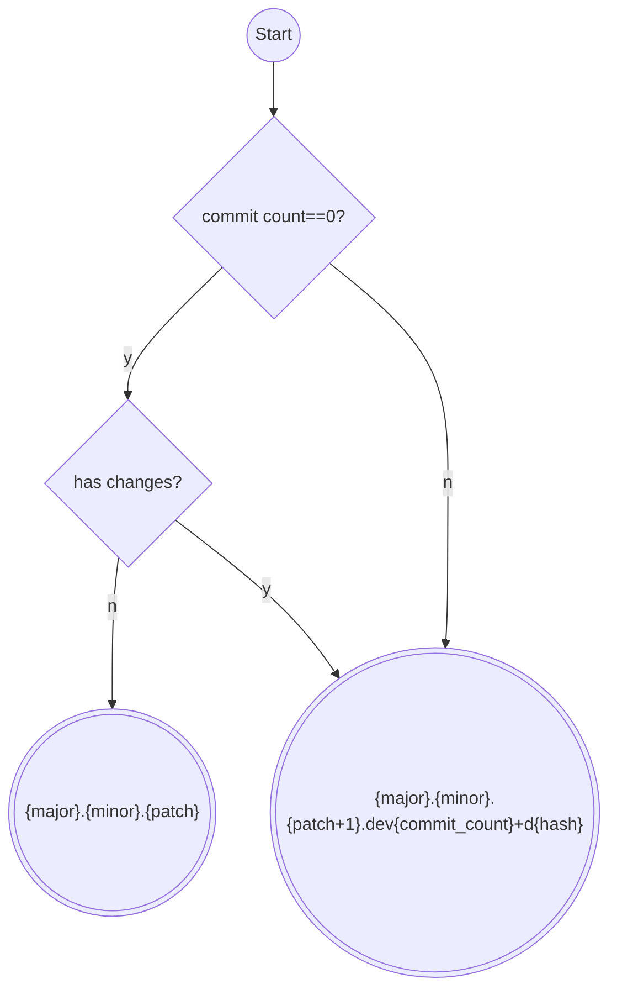
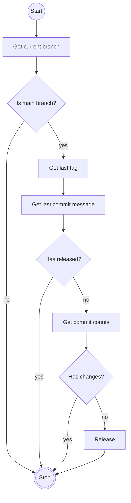

# Git version with bash

## Detect version flow

```mermaid
flowchart TD

processStart@{label: "Start", shape: circle}
conditionCommitCount@{label: "commit count==0?", shape: diam}
conditionHasChanges@{label: "has changes?", shape: diam}
stopAsTag@{label: "{major}.{minor}.{patch}", shape: dbl-circ}
stopPatchInc@{label: "{major}.{minor}.{patch+1}.dev{commit_count}+d{hash}", shape: dbl-circ}

processStart --> conditionCommitCount
conditionCommitCount -->|y| conditionHasChanges
conditionHasChanges -->|n| stopAsTag
conditionHasChanges -->|y| stopPatchInc
conditionCommitCount -->|n| stopPatchInc
```

## Release flow

```mermaid
flowchart TD

processStart@{label: "Start", shape: circle}
getCurrentBranch@{label: "Get current branch", shape: rect}
getLastCommitMessage@{label: "Get last commit message", shape: rect}
getLastTag@{label: "Get last tag", shape: rect}
getCommitCount@{label: "Get commit counts", shape: rect}
isMainBranch@{label: "Is main branch?", shape: diam}
hasReleased@{label: "Has released?", shape: diam}
processStop@{label: "Stop", shape: dbl-circ}
hasChanges@{label: "Has changes?", shape: diam}
release@{label: "Release", shape: rect}

processStart --> getCurrentBranch --> isMainBranch
isMainBranch -->|no| processStop
isMainBranch -->|yes| getLastTag --> getLastCommitMessage --> hasReleased
hasReleased -->|yes| processStop
hasReleased -->|no| getCommitCount --> hasChanges
hasChanges -->|yes| processStop
hasChanges -->|no| release --> processStop
```
